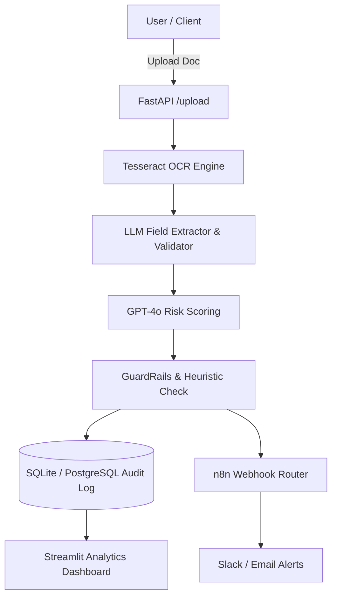

# 🏦 AI Loan Processing Automation — End-to-End Document AI & Risk Scoring

[](https://python.org)
[](https://fastapi.tiangolo.com)
[](https://openai.com)
[](https://github.com/tesseract-ocr/tesseract)
[](https://n8n.io)
[](Dockerfile)
[](LICENSE)

Manual loan processing is slow, inconsistent, and error-prone. Underwriters deal with varied document formats, missing fields, and subjective risk judgments — at scale, this creates bottlenecks and compliance exposure. This system automates the intake, extraction, validation, and routing of loan applications using a combination of OCR, LLM-based reasoning, and rule-based compliance checks.

The pipeline works as follows: documents are submitted via a FastAPI endpoint, Tesseract extracts text from scanned files, and GPT-4o-mini performs KYC field validation and risk scoring. Each application is then routed by confidence threshold — high-confidence approvals and declines are handled automatically; ambiguous cases are queued for human review. All LLM outputs are validated with Pydantic before any decision is written, and GuardRails AI is integrated to block decisions inferred from protected characteristics.

Every decision is persisted with its full reasoning chain to a structured audit log. The system ships with Docker + docker-compose, an n8n workflow JSON for automation orchestration, and a pytest test suite. Sample docs are included.

## 🏗️ Architecture



## 🔧 Tech Stack

- **Backend:** FastAPI, Pydantic, SQLite / PostgreSQL
- **AI & Reasoning:** OpenAI GPT-4o-mini, GuardRails AI
- **OCR:** Tesseract OCR / Form Recognizer adapter
- **Automation:** n8n workflow (JSON schema provided)
- **Frontend:** Streamlit Underwriter Dashboard
- **Containerization:** Docker + docker-compose

## 🚀 Quickstart (Local)

```bash
# 1. Clone repository & create virtual environment
git clone https://github.com/Anoopshukla-AI/AI-Loan-Processing-Automation-.git
cd AI-Loan-Processing-Automation-
python -m venv .venv

# Windows: .venv\Scripts\activate
# Linux/Mac: source .venv/bin/activate
pip install -r requirements.txt

# 2. Configure Environment
cp .env.example .env

# 3. Run FastAPI Backend
uvicorn backend.main:app --reload --port 8000

# 4. Run Streamlit Dashboard (separate terminal)
streamlit run frontend/app.py
```

### Try Sample File Upload
```bash
curl -F "file=@data/sample_docs/sample_loan_form.png" http://localhost:8000/upload
```

## 🐳 Docker Deployment

```bash
docker build -t ai-loan-processing .
docker run -p 8000:8000 --env-file .env ai-loan-processing
```

## 📊 Sample JSON Output

```json
{
  "application_id": "A-2025-001",
  "kyc_status": "valid",
  "document_type": "bank_statement",
  "risk_score": 0.31,
  "compliance_flags": []
}
```

## 🧪 Running Tests

```bash
pytest -q
```
